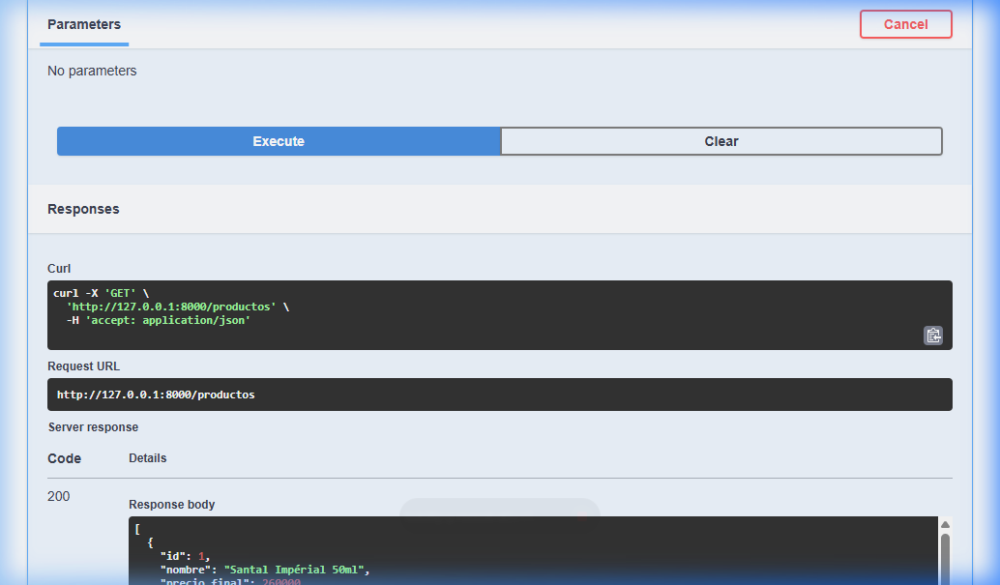
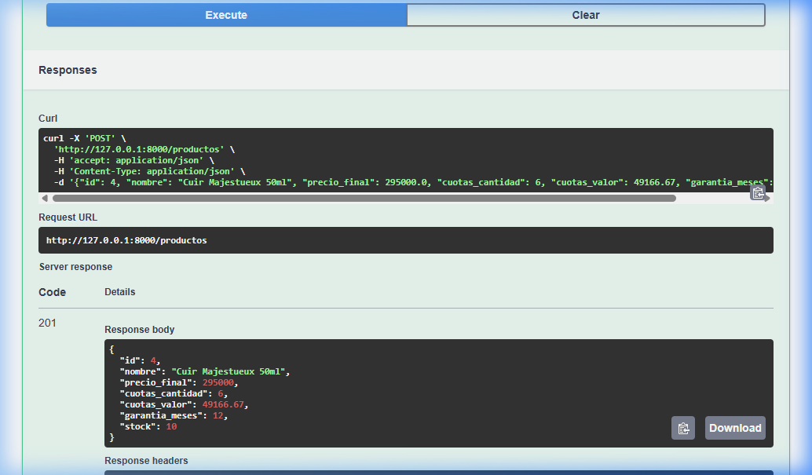
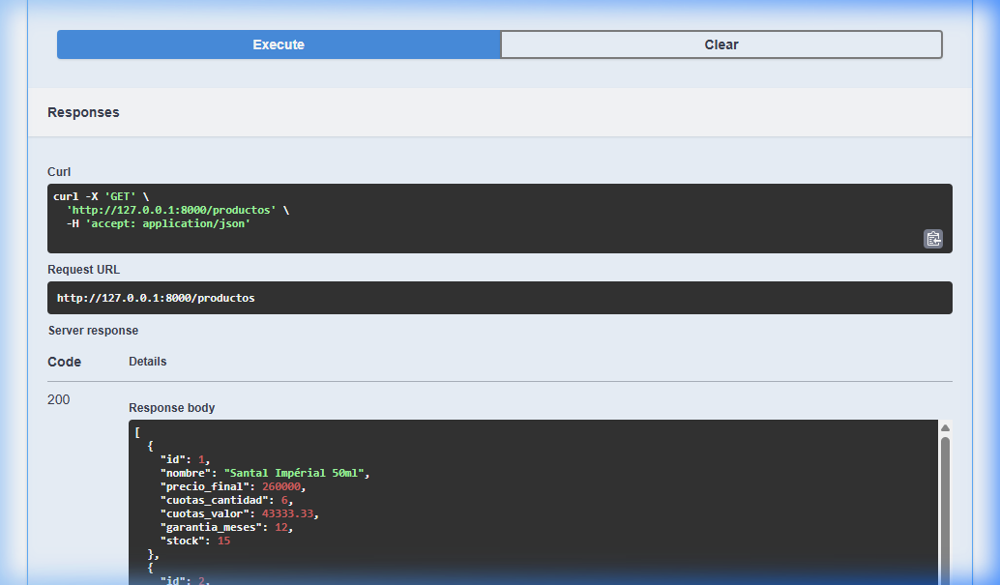
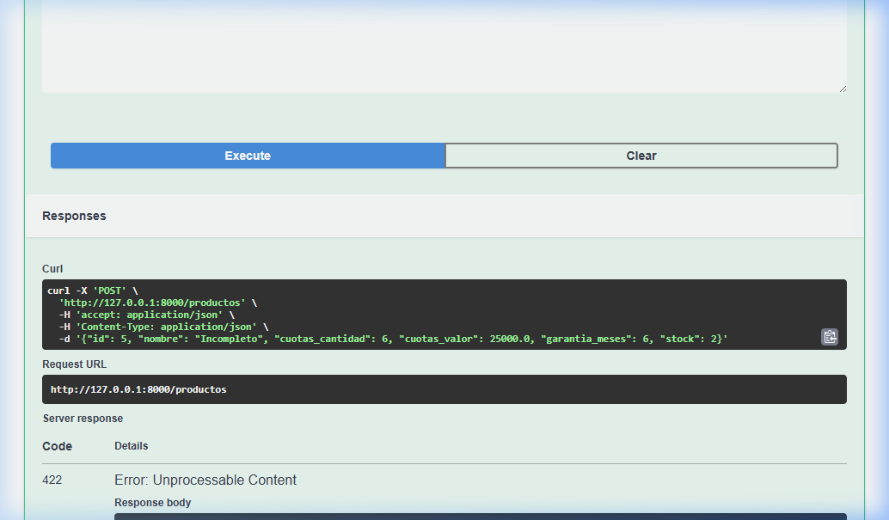

# Entrega — API de Productos (FastAPI)

## Checklist de entrega

- [x] **Modelo Producto con todos los campos del deber de información**
  - Implementado en `app/main.py` con Pydantic (`id`, `nombre`, `precio_final`, `cuotas_cantidad`, `cuotas_valor`, `garantia_meses`, `stock`).
- [x] **Lista `productos_db` con al menos 3 productos**
  - Creada con 3 fragancias reales de la tienda (*Santal Impérial*, *Rose Noire Absolue*, *Iris Nocturne*) con precios y cuotas reales.
- [x] **GET `/productos` funcionando**
  - Retorna la lista completa `productos_db` con código HTTP 200.
- [x] **POST `/productos` funcionando con datos válidos**
  - Recibe un objeto `Producto`, valida duplicados y lo inserta retornando código HTTP 201 Created.
- [x] **Caso de prueba con datos inválidos, devolviendo 422**
  - Se probó enviar un body sin `precio_final` (y sin cuotas/garantía), respondiendo FastAPI con HTTP 422 Unprocessable Content.
- [x] **Captura de Swagger mostrando ambos endpoints probados**
  - Capturas registradas en la carpeta `capturas/` y documentadas a continuación.

---

## Para pensar (respondé en 2-3 líneas)

> **Pregunta:** Si tuvieras que agregar un campo más al modelo Producto para cumplir mejor con el deber de información, ¿cuál agregarías y por qué?

**Respuesta:**
> Agregaría el campo **`costo_financiero_total` (o `cft_porcentaje`)**, ya que según las leyes de defensa del consumidor y lealtad comercial, al publicitar financiación en cuotas es obligatorio informar con claridad si la compra tiene o no intereses y cuál es la tasa efectiva, evitando inducir a error al consumidor.

*(Alternativa igualmente válida: agregar `origen` / `pais_fabricacion` o `fecha_vencimiento_lote`, esenciales en productos cosméticos y perfumería según normativas de rotulado e información general).*

---

## Evidencias de Swagger UI (`/docs`)

### 1. GET `/productos` (200 OK)

### 2. POST `/productos` con datos válidos (201 Created)

### 3. GET `/productos` tras la inserción (4 productos en lista)

### 4. POST `/productos` con datos inválidos (422 Unprocessable Content)

